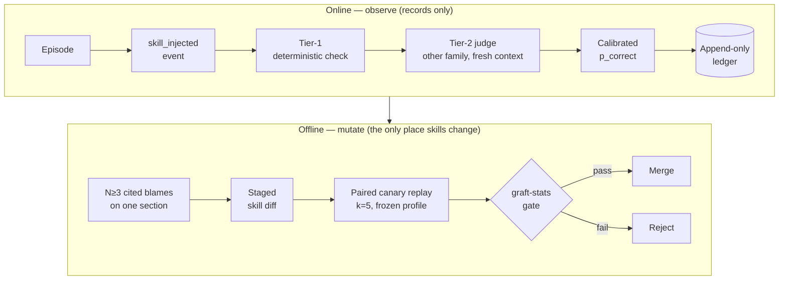
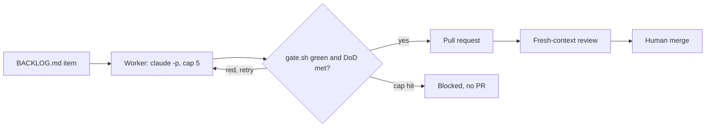

<p align="center">
  <picture>
    <source media="(prefers-color-scheme: dark)" srcset="docs/assets/graft-wordmark-dark.svg">
    
  </picture>
</p>

<p align="center">
  <a href="https://github.com/FurbySoup/graft/actions/workflows/ci.yml"></a>
</p>

**Graft is a research harness designed to let local-model agents improve their skills
only through changes that an independent judge and a pre-registered statistical test
have signed off — never through the agent grading itself.**

> [!WARNING]
> **Pre-alpha. Nothing has been demonstrated yet.** Graft is in Phase 0.5, the second
> of six phases (P0, P0.5, P1–P4). No skill improvement has been shown, the statistical
> merge gate is not implemented, and the runtime plugins are stubs. It is not usable
> by anyone else today.

## What Graft is: skills change offline, by pull request, on evidence

An agent (the *doer*) runs tasks with versioned, sectioned skill files in its context,
and every episode is recorded. Later, an offline pass gathers evidence against specific
skill sections, proposes an edit as a staged diff, and replays fixed regression cases
with the old and new skill. The edit merges only if the replay clears a test committed
before the replay ran.

- **The doer never grades its own work.** Verification is deterministic checks first,
  then a judge from a different model family, with fresh context and no view of the
  doer's reasoning.
- **Online observes, offline mutates.** Runtime code may append events; only the
  offline consolidation pass may change skills, and only through a reviewed diff.
- **Statistics are code.** p-values and effect sizes come from a deterministic engine
  run against a pre-registered config — never from an LLM's reading of the results.

## Why: self-grading corrupts skills instead of improving them

Harnesses that let agents rewrite their own skills tend to fail through uncalibrated
self-assessment: a small model wrongly concludes it succeeded, "reflects", and rewrites
the skill, so errors compound. The design maps that failure onto three classic
reinforcement-learning problems ([SPEC §1](docs/SPEC.md#1-problem)):

| Failure | RL problem | Graft's answer |
|---|---|---|
| Can't validate task success | Reward noise | Tiered independent verification + calibration |
| Can't update the right parts | Credit assignment | Sectioned skills + mechanically validated blame citations |
| Can't measure improvement | Evaluation | Canary replays + statistical gate + visual tracker |

Graft is the second attempt at this idea. The first, Skill Tree, let the doer score its
own output on a rubric that changed at least four times mid-experiment; its best-powered
run (N=224 paired tasks) returned a null result. The failure analysis is in
[docs/prior-art-skill-tree.md](docs/prior-art-skill-tree.md). Nothing from Skill Tree —
skills, code, prompts or configs — was imported.

## How it works: one evidence chain from episode to merge

The top half runs live and can only record; the bottom half runs offline and is the
only place skills change.



The rules the chain depends on:

- **Tier-1 is always first and decisive when it fires** — exit codes, tests, schemas.
  The judge model is only asked what a deterministic check cannot settle.
- **Raw judge confidence is an input, not a truth.** Decisions are designed to gate on
  calibrated probabilities; low-confidence verdicts queue for human review.
- **A blame must cite.** It needs a skill section ID and a quoted trace line, and the
  section must actually have been injected — otherwise it is discarded.
- **Canaries must be deterministic.** A regression case that a judge has to score is
  an invalid canary.
- **No conclusion from a single run.** Comparisons use k runs; trends use EWMA over
  rolling windows.
- **Skills-off episodes are the headline evidence.** A fraction of live episodes will
  run with skills bypassed, so the skills-on vs skills-off gap can be measured.

## The merge gate will require significance AND size

<p align="center">
  <picture>
    <source media="(prefers-color-scheme: dark)" srcset="docs/assets/merge-gate-dark.svg">
    
  </picture>
  <br>
  <em>Design illustration — the gate is not yet implemented.</em>
</p>

Per edit, the gate will run an exact permutation test on paired per-case pass-rate
deltas (α = 0.05, Benjamini–Hochberg corrected across a cycle's edits) **and** require
a median improvement of at least +10 percentage points. Significance without size does
not merge; size without significance does not merge. The thresholds live in
[`ops/stats.yaml`](ops/stats.yaml), committed before any replay batch; the stats engine
is designed to refuse a dirty or changed config. With ≥8 cases and k=5 runs, early
statistical power is low — deliberately, so only large, obvious improvements pass while
the machinery itself earns trust.

## Status: the scaffold exists; the learning loop does not

Known risks come first. Phase 0 surfaced three findings that must be resolved before
Phase 1 can produce meaningful episodes ([PROGRESS.md](PROGRESS.md)):

- **The doer has under ~2K tokens of working context.** The harness's fixed prompt
  takes roughly 6–6.6K of the doer's 8,192-token window.
- **Judge log-probabilities are not usable as confidence as-is.** Under constrained
  decoding they are the pre-grammar-mask distribution, so the sampled verdict token can
  carry near-zero probability while the model's top choice disagrees.
- **The doer's thinking mode is on by default**, so tight token caps can return
  empty content.

| Phase | Scope | Exit criterion (SPEC §8) | State |
|---|---|---|---|
| P0 | Sandbox & scaffold | A harness session completes a toy task with all models reachable; every pin recorded | ✅ Done |
| P0.5 | Dev automation loop | Two backlog items completed unattended end-to-end, human-merged; an impossible task hits the iteration cap and stops cleanly | 🔄 In progress |
| P1 | Observation mode | 25+ real kata episodes with verdicts, validated blame citations, 10 human-audited verdicts; tracker regenerates | ⬜ |
| P2 | Consolidation | One improvement merged with a full evidence chain incl. a stats verdict; one edit rejected by the gate | ⬜ |
| P3 | Calibration, trust & ablation | Rolling Brier score visible; a skill earns trusted state; ablation gap charted | ⬜ |
| P4 | Router & extras (optional) | — | ⬜ |

What exists today:

- **Phase 0 is complete.** The harness (dsh `0.1.5-rc.3`) is pinned exactly with a
  frozen lockfile, the local models are smoke-tested, the pnpm / strict-TypeScript /
  Python scaffold is in place, `ops/stats.yaml` is pre-registered, and the ledger
  schema and migrations exist.
- **Phase 0.5 is in progress.** The worker loop, review pass, commit-gating hooks, CI
  with branch protection, and a project-wide pause have landed. The runaway test
  (P05-RUNAWAY, verified by P05-10), the two live worker items (P05-11, P05-12) and the
  close-out (P05-13) are open in [BACKLOG.md](BACKLOG.md).
- **The core components are placeholders.** The runtime plugins (graft-trust,
  graft-judge, graft-ledger) only log mount/unmount; graft-stats and graft-calibrate
  raise `NotImplementedError`.

**The task domains are only half chosen.** Phase 1 runs on TS/Python micro-katas,
which deterministic tests can settle. A second domain — one that actually exercises the
judge and yields cheap human ground truth for calibration — is **undecided**, and will
be chosen by a scored ADR before Phase 3.

## How it's built: the project applies its own rule to its own development

Development follows the same pattern Graft imposes on skills: an autonomous doer, an
independent reviewer, an evidence trail, and a human gate. A scheduled headless worker
takes one backlog item with a machine-checkable definition of done and opens a pull
request only if the gate is green; a fresh-context review comments; a human merges.
The worker never merges and never touches the hard-exclusion paths (skills, pins, the
stats config, harness config, canary holdouts). Details:
[ops/automation/README.md](ops/automation/README.md).



**Stack.** [DeepSeek Harness (dsh)](docs/decisions/0001-build-on-dsh-pinned-thin-shims.md)
as the runtime chassis, pinned exactly, behind thin plugin shims · harness-agnostic
logic in strict TypeScript (no `any`) · a stdlib-only Python sidecar for calibration
and statistics · local models via Ollama: doer `qwen3:8b` (served as `graft-doer:8k`,
GPU), judge `phi4-mini` (CPU, a different model family), embeddings
`qwen3-embedding:0.6b`. Models are sequenced, never co-resident, to fit a single 8 GB
consumer GPU. Claude acts only as the offline consolidator, never in the runtime loop.
Durable data is plain files: git, SQLite, YAML, JSON.

<details>
<summary><strong>Repo layout</strong></summary>

```
graft/
  docs/                  SPEC, risk register, prior-art analysis, ADRs (decisions/)
  packages/core/         harness-agnostic logic: ledger schema + migrations (TS)
  packages/plugins/      graft-trust, graft-judge, graft-ledger — dsh shims (stubs today)
  sidecars/calibrate/    Python: graft-calibrate + graft-stats (stubs today)
  skills/                sectioned SKILL.md files — human-owned, empty until Phase 1
  canaries/              per-skill deterministic regression cases — empty until Phase 2
  ops/                   pins (VERSIONS.md), stats.yaml, dsh profiles, model files, scripts
  ops/automation/        worker loop, review pass, commit gate, cron installer
  data/                  ledger, sessions, run logs (gitignored)
  BACKLOG.md             groomed tasks with machine-checkable definitions of done
  PROGRESS.md            append-only session handoff log
```

</details>

<details>
<summary><strong>Build &amp; test</strong></summary>

Prerequisites: Node 22 LTS, pnpm 12.6 via corepack, Python 3.14 (the sidecar venv has
no third-party packages). Run from the repo root.

| Purpose | Command |
|---|---|
| Install (reproducible) | `pnpm install --frozen-lockfile` |
| Typecheck (all packages + tests) | `pnpm typecheck` (= `tsc -b`) |
| Lint (no explicit `any`) | `pnpm lint` |
| Test all (TS) | `pnpm test` (= `vitest run`) |
| Test one package | `pnpm --filter @furbysoup/graft-core test` (or `graft-trust` / `graft-judge` / `graft-ledger`) |
| Test one file | `pnpm vitest run packages/core/src/ledger/migrate.test.ts` |
| Everything | `pnpm check` (typecheck → lint → test) |
| Python: test all | `sidecars/calibrate/.venv/bin/python -m unittest discover -s sidecars/calibrate/tests -t sidecars/calibrate` |
| Python: test one file | `sidecars/calibrate/.venv/bin/python -m unittest discover -s sidecars/calibrate/tests -t sidecars/calibrate -p test_scaffold.py` |

CI runs the same gate (typecheck, lint, TS tests, Python tests) via
[`ops/automation/gate.sh`](ops/automation/gate.sh). Running actual episodes needs a
local Ollama server with the pinned models, and is not yet useful: there are no skills,
no judge and no ledger projection to run them through.

</details>

## Docs

- [docs/SPEC.md](docs/SPEC.md) — the full build specification: architecture, data formats, statistics, phases
- [docs/RISK-REGISTER.md](docs/RISK-REGISTER.md) — known risks, mitigations and review triggers
- [docs/prior-art-skill-tree.md](docs/prior-art-skill-tree.md) — why the first attempt could not evidence improvement
- [docs/decisions/](docs/decisions/) — architecture decision records
- [BACKLOG.md](BACKLOG.md) — groomed tasks and their definitions of done
- [PROGRESS.md](PROGRESS.md) — the append-only handoff log, including phase close-outs

## Contributing & license

This is a personal research project. Issues are welcome; pull requests are
backlog-driven and human-merged.

No license has been chosen yet; all rights reserved by default.
